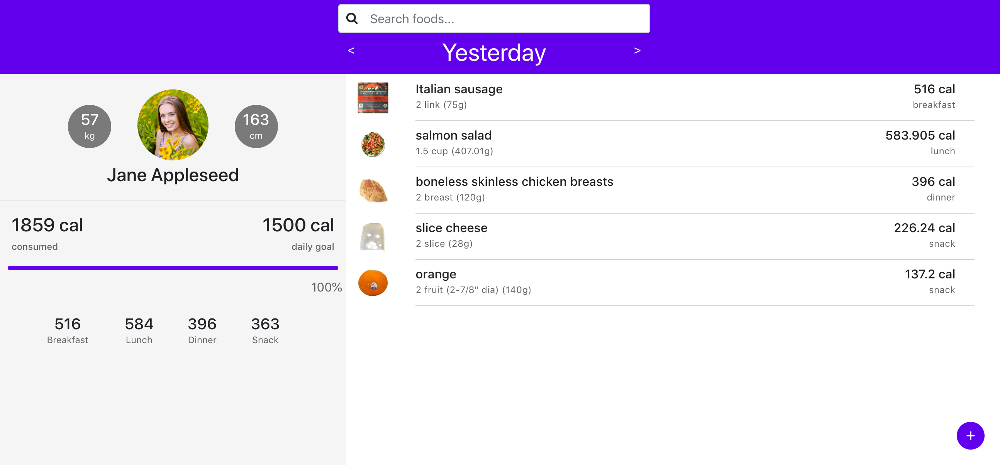
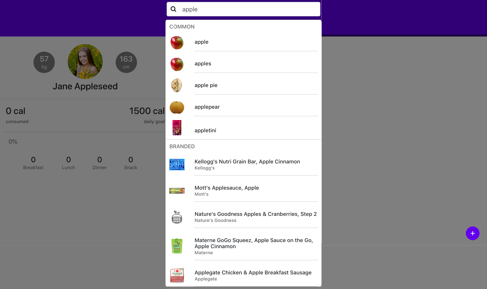
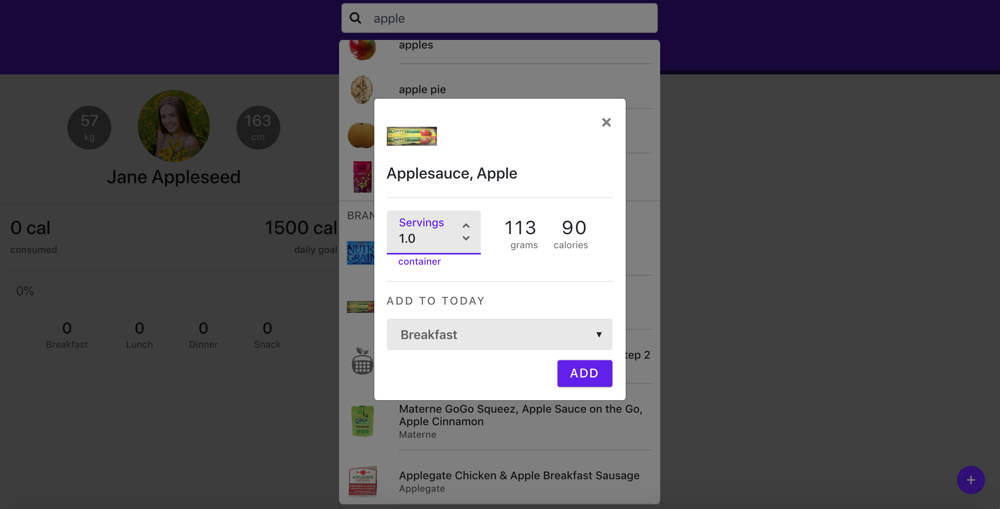
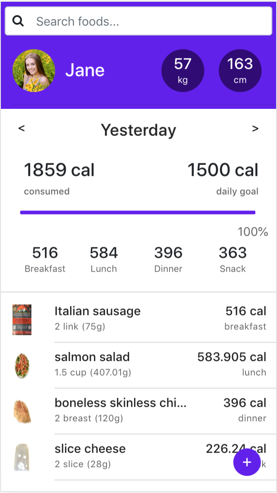

# GymApp

## Introduction

This is a single page react App which can be recording user intakes of nutrition to help them reaching daily goals. All information are supplied by Nutritionix API(https://developer.nutritionix.com/docs/v2).

<br />

## Description

This application mainly structured by 5 component: Header, UserPanel, FoodList, SearchButton and SearchList. They will be showing in the following screenshot part. For the data layer, redux has been used to manage all the certain datas which includes the userQueryResponse, currentPageId, userFoodList etc.

<br />

## ScreenShots





<p align="center"></p>

<br />

## Deploy

If you don't have react environment, please install react first:
```javascript
npm install
```

Since you installed react, you can clone this repository now:
```javascript
git clone https://github.com/SmilingCode/GymApp.git
```

Before execute npm start, please have a look on the package.json file, make sure you have all those packages in your local environment.
```javascript
npm install --save
npm install --save-dev
```

In the end, run our application by executing:
```javascript
npm start
```
